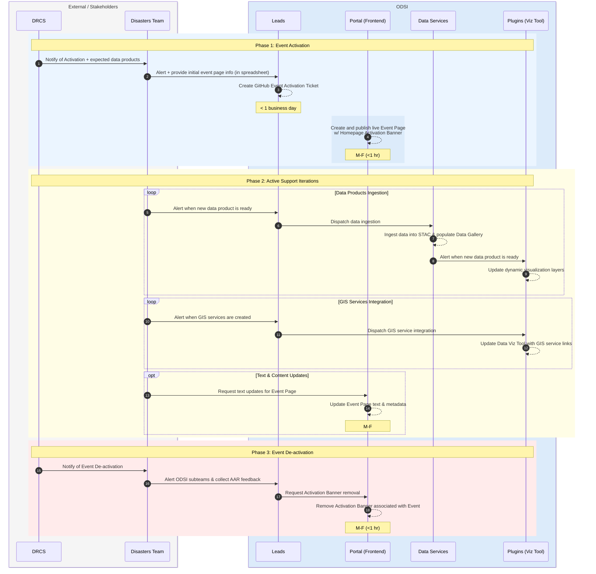

# Event Activation Workflow

```mermaid
sequenceDiagram
    autonumber

    box rgb(245, 245, 245) External / Stakeholders
        participant DRCS
        participant Disasters as Disasters Team
    end
    box rgb(220, 235, 250) ODSI
        participant Leads as Leads
        participant Portal as Portal (Frontend)
        participant Data as Data Services
        participant Plugins as Plugins (Viz Tool)
    end

    rect rgb(235, 245, 255)
        note over DRCS, Plugins: Phase 1: Event Activation
        DRCS->>Disasters: Notify of Activation + expected data products
        Disasters->>Leads: Alert + provide initial event page info (in spreadsheet)
        Leads-->>Leads: Create GitHub Event Activation Ticket
            note over Leads: < 1 business day
        rect rgb(220, 235, 250)
            Portal-->>Portal: Create and publish live Event Page <br/> w/ Homepage Activation Banner
            note over Portal: M-F (<1 hr)
        end
    end

    rect rgb(255, 253, 230)
        note over DRCS, Plugins: Phase 2: Active Support Iterations
        loop Data Products Ingestion
            Disasters->>Leads: Alert when new data product is ready
            Leads->>Data: Dispatch data ingestion
            Data-->>Data: Ingest data into STAC & populate Data Gallery
            Data->>Plugins: Alert when new data product is ready
            Plugins-->>Plugins: Update dynamic visualization layers
        end
        loop GIS Services Integration
            Disasters->>Leads: Alert when GIS services are created
            Leads->>Plugins: Dispatch GIS service integration
            Plugins-->>Plugins: Update Data Viz Tool with GIS service links
        end
        opt Text & Content Updates
            Disasters->>Portal: Request text updates for Event Page
            Portal-->>Portal: Update Event Page text & metadata
            note over Portal: M-F
        end
    end

    rect rgb(255, 235, 235)
        note over DRCS, Plugins: Phase 3: Event De-activation
        DRCS->>Disasters: Notify of Event De-activation
        Disasters->>Leads: Alert ODSI subteams & collect AAR feedback
        Leads->>Portal: Request Activation Banner removal
        Portal-->>Portal: Remove Activation Banner associated with Event
        note over Portal: M-F (<1 hr)
    end
```
